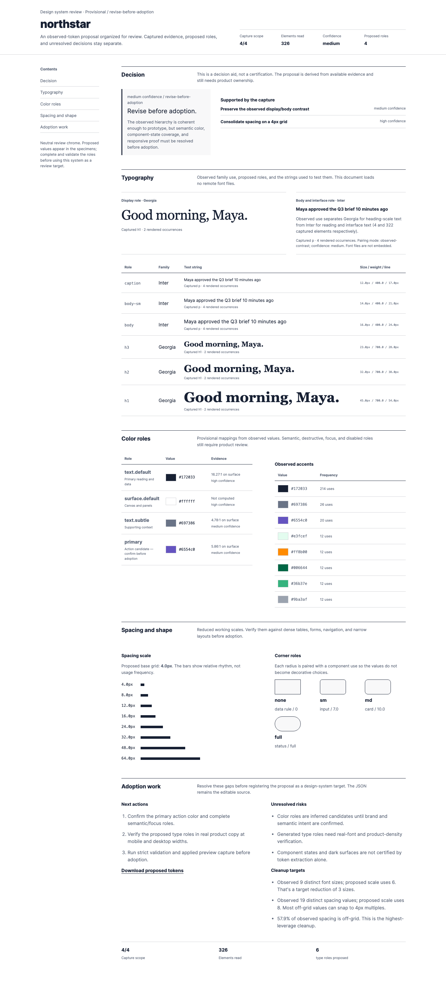

<p align="center">
  
</p>

<h1 align="center">Keen</h1>

<p align="center"><strong>A second set of eyes for better web design.</strong></p>

<p align="center">
  <a href="https://github.com/KyBerry/keen/actions/workflows/ci.yml"></a>
  
  <a href="LICENSE"></a>
</p>

Keen helps coding agents make websites that feel thoughtful, polished, and
consistent—not generic.

It can help when you are starting from nothing, working through a half-built
product, improving a finished page, or checking new work against an established
design.

## What Keen helps with

- **Find a direction** — see a few strong options and choose what fits.
- **Make it clear** — turn that choice into guidance the whole project can use.
- **Improve the real page** — catch weak hierarchy, awkward spacing, generic
  patterns, and details that feel unfinished.
- **Keep it consistent** — check new work against the decisions you already
  made.

Keen looks at the actual product, not a made-up demo. It reads the code and
content, works within the project's constraints, and checks its work in the
browser.

## Try asking

> Help me find the right look and feel for this site.

> Make this page feel polished and less generic.

> We are halfway through this product. Clean up the inconsistencies and make
> the design easier to continue.

> Check that this change still fits the rest of the product.

You can speak to Keen naturally. Focused workflows are also available as
`/keen:explore`, `/keen:establish`, `/keen:refine`, and `/keen:guard` in Claude
Code, or with `$keen:` in Codex.

## See choices before committing

When the look and feel is still unclear, Keen can open a small local workshop
with two or three directions made for your product. Each option shows what it
would feel like, why it might work, and where it could go wrong.

Pick one, combine ideas, or reject the set. Keen then builds the smallest useful
version, checks it in the browser, and only keeps decisions that still feel right
after seeing the result.

The workshop stays on your computer and loads no remote images.

## Install

Keen includes a plugin for the coding agent and a local command-line tool for
browser checks.

```bash
git clone https://github.com/KyBerry/keen.git
cd keen
```

### Claude Code

```bash
claude plugin marketplace add "$PWD"
claude plugin install keen@keen
uv tool install --force --reinstall --editable "$PWD/plugins/keen"
uv tool run --from "$PWD/plugins/keen" playwright install chromium
keen doctor
```

### Codex

```bash
codex plugin marketplace add "$PWD"
codex plugin add keen@keen
uv tool install --force --reinstall --editable "$PWD/plugins/keen"
uv tool run --from "$PWD/plugins/keen" playwright install chromium
keen doctor
```

Start a new Claude Code session or Codex task after installation.

## What Keen remembers

Keen can save the design decisions that should survive the current chat:

```text
.keen/
├── design-context.json   project design memory for coding agents
└── direction.md          the same direction in a readable document
```

Commit these two files when you want every developer and agent to work from the
same direction. Temporary screenshots and reports can stay untracked.

```gitignore
.keen/*
!.keen/design-context.json
!.keen/direction.md
```

<details>
  <summary><strong>Browser reviews and reports</strong></summary>

Keen can review a running page at mobile and desktop sizes:

```bash
keen review "http://localhost:3000" --allow-internal --viewports mobile,desktop
```

The review includes a readable HTML report, screenshots, and structured
evidence for the agent. Measurements help the model investigate; they are not
presented as a score for whether a design is beautiful.

<br>

</details>

<details>
  <summary><strong>More commands</strong></summary>

```bash
keen doctor
keen capture "http://localhost:3000" --allow-internal --viewports mobile,desktop
keen audit ".keen/review/<run>"
keen tokens ".keen/review/<run>"
keen diff ".keen/review/<baseline>" ".keen/review/<current>"
```
</details>

## Safety

- A review does not give Keen permission to edit the product.
- Keen only builds or fixes something when you ask it to.
- Local project artifacts stay inside the project.
- The local tool has no telemetry or model SDK.
- Internal and file review permissions are scoped to explicitly named origins
  and documents; add a separate development API with `--allow-origin`.

See the [security policy](SECURITY.md) for private vulnerability reporting and
guidance on protecting local review data.

<details>
  <summary><strong>Development</strong></summary>

```bash
cd plugins/keen
uv sync --all-extras --locked
uv run playwright install chromium
uv run pytest -q
uv run ruff check harness tests scripts
uv run mypy harness
uv run python scripts/validate_prompts.py
uv run python scripts/evaluate_skill_contracts.py
uv run python scripts/evaluate_direction_workshop.py --platform static
uv run python scripts/smoke_wheel.py
```

The canonical plugin lives in `plugins/keen/`. Generate the Codex bundle with
`python plugins/keen/scripts/sync_codex_plugin_bundle.py`; do not edit
`codex-plugins/keen/` directly.
</details>

## License

[MIT](LICENSE) © Kyle Berry
